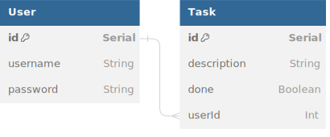

## Architecture

### Backend

The backend consists of an [Express](https://expressjs.com/) server with a SQLite database and [Prisma](https://www.prisma.io/) as the ORM. The entrypoint is `src/server/index.js`.

API routes can be found in `src/server/api/`.

Authentication is handled with [JWT](https://github.com/auth0/node-jsonwebtoken). User passwords are hashed with [bcrypt](https://github.com/kelektiv/node.bcrypt.js).



<details>
<summary>Expand to see DBML</summary>

```dbml
Table User {
  id       Serial [pk]
  username String @unique
  password String
  games    Game[]
  posts    Post[]
  comments Comment[]
}

Table Game {
  id          Serial [pk]
  title       String
  time        String
  userId      Int
  imageUrl    String
  review      String
  user        User    
}

Table Post {
id          Serial [pk]
title       String
createdAt   DateTime @default(now())
userId      Int
postContent String
user        User    
comments    Comment[]
}

Table Comment {
id          Serial [pk]
comment     String
createdAt   DateTime @default(now())
postId      Int
userId      Int
post        Post    
user        User    
}


Ref: User.id < Game.userId
Ref: User.id < Post.userId
Ref: User.id < Comment.userId
Ref: Post.id < Comment.postId
```

</details>

### Frontend

The frontend is a [React](https://react.dev/) app created with [Vite](https://vitejs.dev/). Vite middleware is used in development, but the frontend should be built for production.

Routing is handled with [React Router](https://reactrouter.com/en/main). The router is defined in `src/client/main.jsx`.

Application state is managed with [Redux Toolkit](https://redux-toolkit.js.org/). The store is defined in `src/client/store/index.js`. Additional slices should be defined separately in `src/client/features`.

[RTK Query](https://redux-toolkit.js.org/rtk-query/overview) is used to handle data fetching. The central API slice is defined in `src/client/store/api.js` and is intended to stay empty. Additional endpoints should be injected separately in `src/client/features`.

[Less](https://lesscss.org/) is used as the CSS preprocessor.
